# 🛡️ Threat Hunt Report: CrossCheck – Multi-Stage HR Data Exfiltration Simulation

**Unauthorized Year-End Compensation Data Access & Staging**

---

## 📌 Overview

| **Attribute** | **Details** |
|---------------|-------------|
| **Hunt Name** | CrossCheck |
| **Detection Platform** | Microsoft Defender for Endpoint |
| **Query Language** | Kusto Query Language (KQL) |
| **Operating Systems** | Windows 10 Enterprise / Windows Server 2019/2022 |
| **Investigation Period** | December 1–31, 2025 |
| **Report Generated** | February 16, 2026 |
| **Classification** | Internal Use Only |
| **Analyst** | Security Operations Team |

---

## 🎯 Executive Summary

During routine monitoring of year-end financial activity, the Security Operations Center (SOC) detected abnormal access patterns involving sensitive compensation and performance review data. What initially appeared as legitimate administrative access evolved into a sophisticated, multi-stage intrusion chain involving:

- **Remote session misuse** from multiple organizational contexts
- **PowerShell-based tooling** for reconnaissance and data manipulation
- **Systematic reconnaissance** of target systems and user privileges
- **Unauthorized access** to sensitive HR documents (bonus matrices, performance reviews, employee scorecards)
- **Data staging** into compressed archives for exfiltration preparation
- **Dual persistence mechanisms** via registry Run keys and scheduled tasks
- **Multiple exfiltration attempts** through outbound network connections
- **Anti-forensic measures** including PowerShell operational log clearing
- **Lateral expansion** to secondary endpoints with similar attack patterns

The activity demonstrates **intentional discovery, preparation, and attempted exfiltration** of sensitive compensation data, affecting multiple systems across different user contexts and departmental boundaries. The operation shows characteristics consistent with insider threat activity or compromised credentials used for unauthorized financial data access.

**Affected Systems:** 2 endpoints  
**Remote Session Sources:** 4 distinct devices (M1-ADMIN, YE-HELPDESKTECH, YE-HRPLANNER, YE-FINANCEREVIE)  
**Data at Risk:** Year-end bonus matrices, performance reviews, employee scorecards, candidate packages

---

## 🗺️ MITRE ATT&CK Mapping

This investigation aligns to the following MITRE ATT&CK tactics and techniques:

| **Tactic** | **Technique** | **ID** | **Observed Evidence** |
|------------|---------------|--------|----------------------|
| **Initial Access** | Valid Accounts | [T1078](https://attack.mitre.org/techniques/T1078/) | Remote session from 192.168.0.110 using account `5y51-d3p7` |
| **Execution** | PowerShell | [T1059.001](https://attack.mitre.org/techniques/T1059/001/) | Payroll-themed PowerShell script execution |
| **Discovery** | Account Discovery | [T1033](https://attack.mitre.org/techniques/T1033/) | `whoami.exe` execution for identity enumeration |
| **Discovery** | System Information Discovery | [T1082](https://attack.mitre.org/techniques/T1082/) | `query.exe`, `tasklist.exe` for system reconnaissance |
| **Persistence** | Registry Run Keys | [T1547.001](https://attack.mitre.org/techniques/T1547/001/) | HKCU Run key modification for persistence |
| **Persistence** | Scheduled Task | [T1053.005](https://attack.mitre.org/techniques/T1053/005/) | Scheduled task creation via `schtasks.exe` |
| **Defense Evasion** | Clear Windows Event Logs | [T1070.001](https://attack.mitre.org/techniques/T1070/001/) | `wevtutil.exe cl Microsoft-Windows-PowerShell/Operational` |
| **Collection** | Archive Collected Data | [T1560](https://attack.mitre.org/techniques/T1560/) | ZIP archives: Q4Candidate_Pack.zip, YearEnd_ReviewPackage_2025.zip |
| **Exfiltration** | Exfiltration Over Web Service | [T1567](https://attack.mitre.org/techniques/T1567/) | Outbound connections to external IPs post-staging |
| **Lateral Movement** | Remote Services | [T1021](https://attack.mitre.org/techniques/T1021/) | Expansion from sys1-dept to main1-srvr |

> **Note:** Mapping activity to ATT&CK techniques reinforces that this intrusion followed a structured, multi-stage adversary pattern rather than isolated misuse.

---

## 🧩 Environment & Tooling

### Detection Infrastructure
- **Primary Platform:** Microsoft Defender for Endpoint (MDE)
- **SIEM Integration:** Azure Sentinel
- **Query Language:** Kusto Query Language (KQL)
- **Alert Framework:** Custom detection rules + behavioral analytics

### Target Environment
- **Operating Systems:** Windows 10 Enterprise (21H2), Windows Server 2019/2022
- **Network Segment:** Corporate LAN (192.168.0.0/24)
- **Affected Business Units:** Information Technology, Human Resources, Finance
- **Domain:** Internal Active Directory environment

### Telemetry Sources
- `DeviceProcessEvents` - Process creation, command-line arguments, parent-child relationships
- `DeviceFileEvents` - File system operations (create, read, modify, delete)
- `DeviceRegistryEvents` - Registry key creation and modification
- `DeviceNetworkEvents` - Network connection attempts, URLs, remote IPs
- `DeviceEvents` - General device activity and security events

---

## 🧠 Investigation Methodology

This threat hunt employed a **hypothesis-driven approach** based on behavioral analytics, correlating multiple telemetry streams to reconstruct the complete attack chain:

### Investigation Phases

1. **Initial Detection Trigger**
   - Anomalous remote session patterns during off-hours to HR file shares
   - Spike in PowerShell execution from non-standard user directories

2. **Lateral Correlation Analysis**
   - Process execution chains linked to remote session contexts
   - File access patterns involving sensitive HR directories
   - Registry and scheduled task modifications for persistence

3. **Data Staging Identification**
   - Archive creation (ZIP files) following sensitive file access
   - Temporal correlation between file access and compression activity

4. **Exfiltration Validation**
   - Network connection attempts following data staging
   - Outbound POST requests to external IPs

5. **Anti-Forensic Detection**
   - Log clearing attempts using Windows Event utility
   - Evidence of operational security awareness

6. **Scope Expansion**
   - Cross-device hunting to identify lateral movement
   - Similar behavioral patterns on secondary endpoints

### Analytical Approach
Each finding builds logically on the previous one, forming a complete intrusion narrative from initial access through attempted exfiltration. This methodology ensures comprehensive coverage while minimizing false positives.

---

## 🔍 Detailed Findings & Analysis

### 🚩 Flag 01: Initial Endpoint Association

**Objective:** Identify the first endpoint associated with suspicious user activity.

**Finding:** The local account `5y51-d3p7` first appeared on endpoint **`sys1-dept`** during the investigation timeframe.

**Significance:** This represents the initial point of entry and primary target for data access operations.

**KQL Query:**
```kql
DeviceProcessEvents
| where Timestamp between (datetime(2025-12-01) .. datetime(2025-12-04))
| where AccountName =~ "5y51-d3p7"
| project Timestamp, DeviceName, AccountName, FileName, ProcessCommandLine
| order by Timestamp asc
```

**Screenshot:**

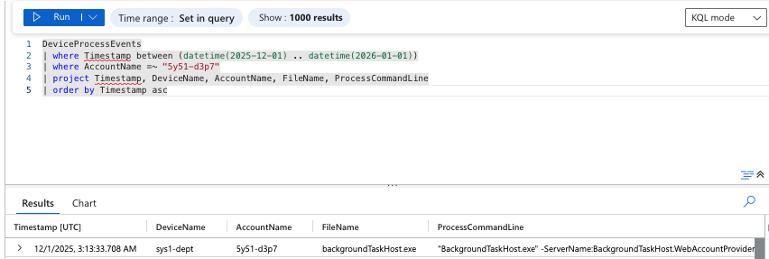

---

### 🚩 Flag 02: Remote Session Source Attribution

**Objective:** Identify the remote source initiating access to the compromised endpoint.

**Finding:** Remote session originated from:
- **Source IP:** `192.168.0.110`
- **Remote Device:** `M1-ADMIN`

**Significance:** Indicates remote administrative access, potentially leveraging legitimate remote management tools (RDP, WinRM, PSRemoting).

**KQL Query:**
```kql
DeviceProcessEvents
| where Timestamp between (datetime(2025-12-01) .. datetime(2025-12-04))
| where DeviceName == "sys1-dept"
| where AccountName =~ "5y51-d3p7"
| where IsProcessRemoteSession == true
| project Timestamp, DeviceName, AccountName, ProcessRemoteSessionIP, ProcessRemoteSessionDeviceName
| order by Timestamp asc
```

**Screenshot:**

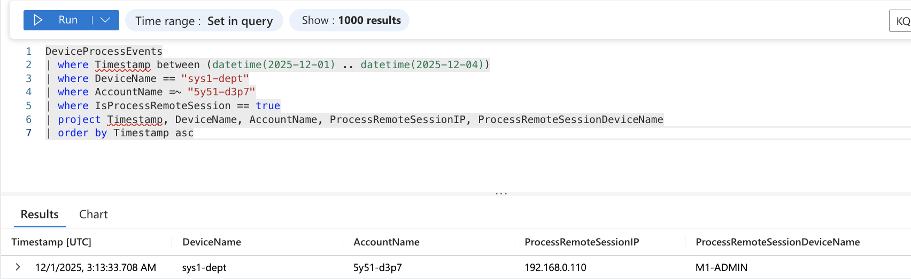

---

### 🚩 Flag 03: Support-Themed Script Execution

**Objective:** Detect execution of suspicious PowerShell scripts potentially masquerading as legitimate support tooling.

**Finding:** A payroll-themed PowerShell script (`.ps1`) executed from a user-writable directory, not a standard administrative tools location.

**Significance:** Social engineering theme (payroll/support) combined with PowerShell execution from non-standard paths indicates potential malicious scripting activity.

**KQL Query:**
```kql
DeviceProcessEvents
| where Timestamp between (datetime(2025-12-01) .. datetime(2025-12-04))
| where DeviceName == "sys1-dept"
| where AccountName contains "5y51-d3p7"
| where FileName in~ ("powershell.exe","pwsh.exe")
| where ProcessCommandLine has ".ps1"
| project Timestamp, DeviceName, AccountName, ProcessCommandLine
| order by Timestamp asc
```

**Screenshot:**

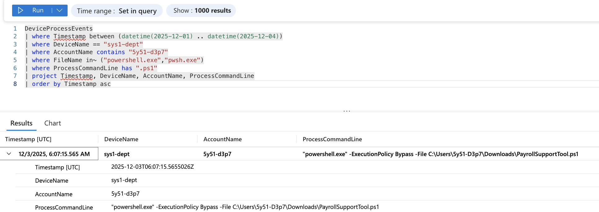

---

### 🚩 Flag 04: Reconnaissance Activity

**Objective:** Confirm early-stage system enumeration and situational awareness gathering.

**Finding:** Initial reconnaissance executed via identity and system enumeration utilities:
- `whoami.exe` - Current user identity
- `query.exe` - User session information
- `tasklist.exe` - Running process enumeration

**Significance:** Classic post-access reconnaissance pattern. Adversary is gathering environmental context before proceeding with objectives.

**KQL Query:**
```kql
DeviceProcessEvents
| where Timestamp between (datetime(2025-12-01) .. datetime(2025-12-04))
| where DeviceName == "sys1-dept"
| where FileName in~ ("whoami.exe","query.exe","tasklist.exe")
| project Timestamp, DeviceName, AccountName, ProcessCommandLine
| order by Timestamp asc
```

**Screenshot:**

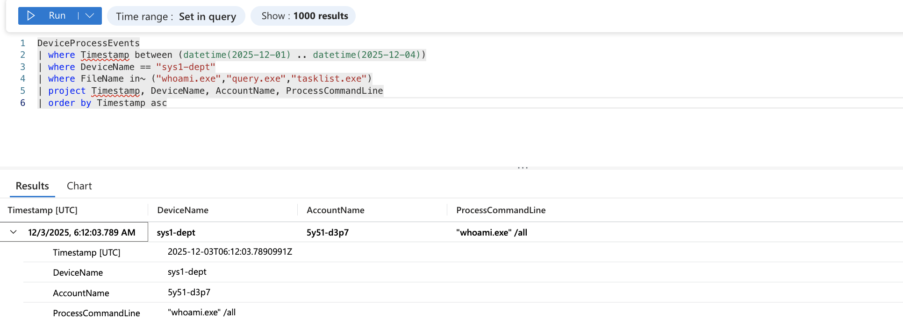

---

### 🚩 Flag 05: Sensitive Bonus File Discovery

**Objective:** Identify unauthorized access to sensitive compensation data during the discovery phase.

**Finding:** Draft bonus matrix files accessed during the reconnaissance phase, indicating targeted search for financial/HR data.

**Significance:** Confirms that the adversary has identified and accessed high-value targets (compensation data). This marks the transition from reconnaissance to collection.

**KQL Query:**
```kql
DeviceFileEvents
| where Timestamp between (datetime(2025-12-01) .. datetime(2025-12-04))
| where DeviceName == "sys1-dept"
| where FileName contains "Bonus"
| project Timestamp, FileName, FolderPath, InitiatingProcessRemoteSessionDeviceName
| order by Timestamp asc
```

**Screenshot:**

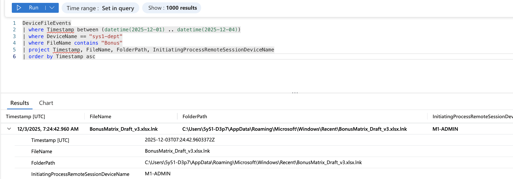

---

### 🚩 Flag 06: Data Staging via Archive Creation

**Objective:** Confirm preparation of sensitive data for exfiltration through compression and consolidation.

**Finding:** A ZIP archive was created shortly after sensitive file access, consistent with data staging behavior.

**Significance:** Archive creation following file access is a strong indicator of exfiltration preparation. Compression reduces file size and consolidates multiple files for easier transfer.

**KQL Query:**
```kql
DeviceFileEvents
| where Timestamp between (datetime(2025-12-01) .. datetime(2025-12-04))
| where DeviceName == "sys1-dept"
| where FileName endswith ".zip"
| project Timestamp, FileName, FolderPath, InitiatingProcessUniqueId
| order by Timestamp asc
```

**Screenshot:**

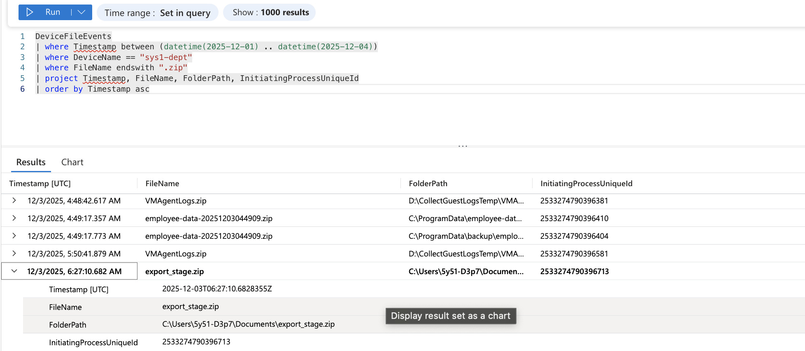

---

### 🚩 Flag 07: Outbound Connectivity Test

**Objective:** Validate attempted external network connectivity for potential data exfiltration.

**Finding:** Outbound connection attempted from PowerShell process to external endpoint, indicating exfiltration channel testing.

**Significance:** Network connection attempt following data staging strongly suggests exfiltration activity. This validates the complete attack chain: access → collect → stage → exfiltrate.

**KQL Query:**
```kql
DeviceNetworkEvents
| where TimeGenerated between (datetime(2025-12-03) .. datetime(2025-12-04))
| where DeviceName == "sys1-dept"
| where InitiatingProcessFileName in~ ("powershell.exe","pwsh.exe")
| project TimeGenerated, RemoteIP, RemoteUrl, InitiatingProcessCommandLine
| order by TimeGenerated asc
```

**Screenshot:**

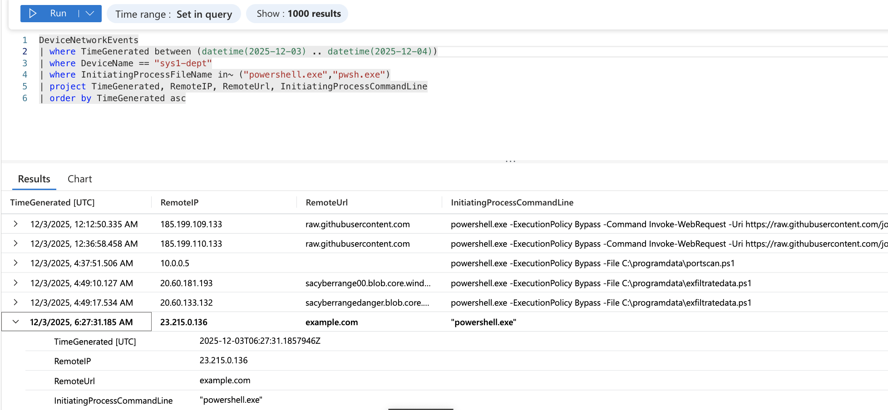

---

### 🚩 Flag 08: Registry-Based Persistence

**Objective:** Identify persistence mechanisms to maintain access across system reboots.

**Finding:** Persistence established via **HKCU\Software\Microsoft\Windows\CurrentVersion\Run** registry key modification.

**Significance:** Registry Run key persistence is a common technique (MITRE T1547.001) for maintaining access. Indicates adversary intent to maintain long-term access beyond initial session.

**KQL Query:**
```kql
DeviceRegistryEvents
| where Timestamp between (datetime(2025-12-03) .. datetime(2025-12-04))
| where RegistryKey has "CurrentVersion\\Run"
| project Timestamp, RegistryKey, RegistryValueName, RegistryValueData
| order by Timestamp asc
```

**Screenshot:**

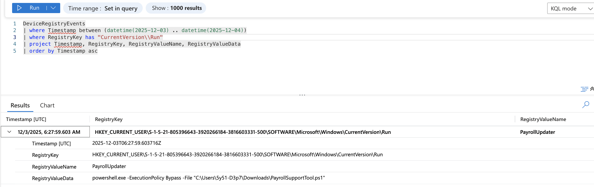

---

### 🚩 Flag 09: Scheduled Task Persistence

**Objective:** Confirm secondary persistence method through scheduled task creation.

**Finding:** Scheduled task created via `schtasks.exe` to maintain execution capability.

**Significance:** Dual persistence mechanisms (Registry + Scheduled Task) demonstrate sophisticated adversary tradecraft and redundancy planning.

**KQL Query:**
```kql
DeviceProcessEvents
| where Timestamp between (datetime(2025-12-03) .. datetime(2025-12-04))
| where ProcessCommandLine has "schtasks"
| project Timestamp, DeviceName, ProcessCommandLine
| order by Timestamp asc
```

**Screenshot:**

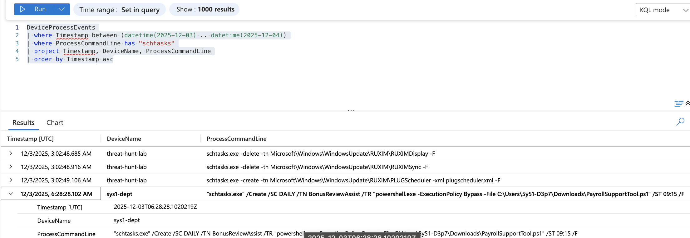

---

### 🚩 Flag 10: Secondary Access to Employee Scorecard Artifact

**Objective:** Identify evidence that a different remote session context accessed employee-related scorecard material, indicating potential credential sharing or multiple actors.

**Finding:** File telemetry revealed that employee scorecard-related artifacts were accessed under a **different remote session context**, originating from:
- **Remote Session Device:** `YE-HELPDESKTECH`

**Significance:** This access occurred shortly after persistence mechanisms were established, indicating continued exploration of sensitive HR data beyond the initial bonus artifacts. The change in remote session context suggests either:
1. Multiple compromised accounts
2. Lateral movement across different organizational units
3. Coordinated insider threat activity

**KQL Query:**
```kql
DeviceFileEvents
| where Timestamp between (datetime(2025-12-03) .. datetime(2025-12-04))
| where DeviceName == "sys1-dept"
| where FileName has_any ("Review", "Scorecard")
| project Timestamp, FileName, FolderPath,
         InitiatingProcessRemoteSessionDeviceName, DeviceName
| order by Timestamp asc
```

**Screenshot:**

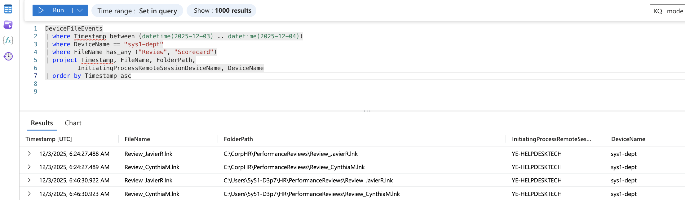

---

### 🚩 Flag 11: Bonus Matrix Activity by New Remote Session Context

**Objective:** Determine whether additional departments interacted with sensitive bonus payout files, expanding the scope of compromise.

**Finding:** Subsequent access to bonus-related artifacts was associated with **another distinct remote session context**:
- **Remote Session Device:** `YE-HRPLANNER`

**Significance:** This activity suggests lateral exposure of compensation data across multiple departments (Helpdesk → HR) rather than isolated access. The pattern indicates:
- Potential credential compromise across organizational boundaries
- Coordinated data collection from multiple sources
- Cross-departmental awareness of sensitive data locations

**KQL Query:**
```kql
DeviceFileEvents
| where Timestamp between (datetime(2025-12-03) .. datetime(2025-12-10))
| where DeviceName == "sys1-dept"
| where FileName has ".zip"
| project Timestamp, FileName,
         InitiatingProcessRemoteSessionDeviceName
| order by Timestamp asc
```

**Screenshot:**

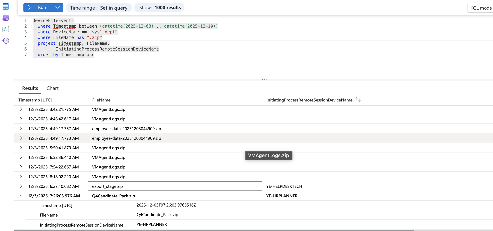

---

### 🚩 Flag 12: Performance Review Access Validation

**Objective:** Confirm access to employee performance review materials through user-level tooling, expanding the dataset beyond compensation.

**Finding:** Process telemetry showed user-level access to performance review documents from a different directory path, indicating broader data discovery beyond bonus artifacts.

**Key Details:**
- **Access Timestamp:** `2025-12-03T07:25:15.6288106Z`
- **Data Type:** Performance reviews (separate from compensation data)

**Significance:** The adversary is systematically accessing multiple categories of sensitive HR data, not just financial compensation. This suggests:
- Comprehensive data collection objectives
- Understanding of organizational data structure
- Potential for more significant business impact

**KQL Query:**
```kql
DeviceProcessEvents
| where Timestamp between (datetime(2025-12-03T07:20:00Z) .. datetime(2025-12-03T07:30:00Z))
| where DeviceName == "sys1-dept"
| where ProcessCommandLine has_any ("Review", "Performance")
| project Timestamp, DeviceName, AccountName, ProcessCommandLine
| order by Timestamp asc
```

**Screenshot:**

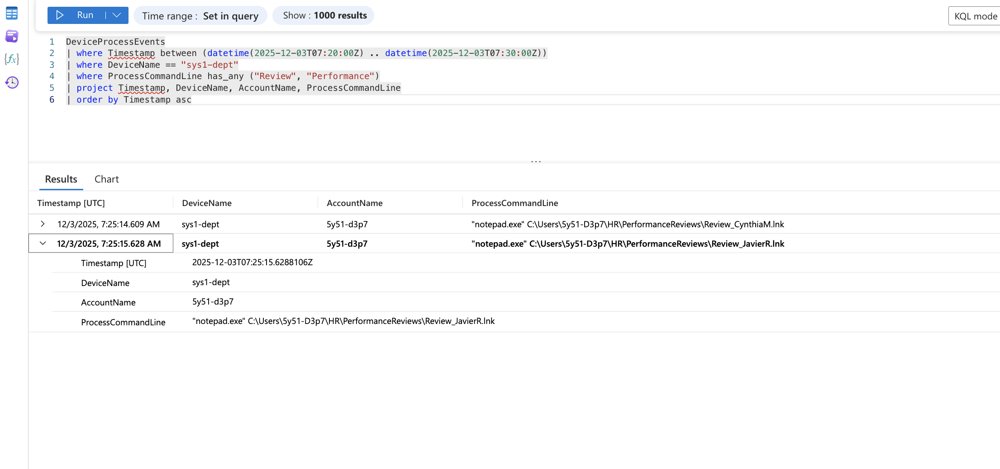

---

### 🚩 Flag 13: Approved / Final Bonus Artifact Access

**Objective:** Confirm unauthorized access to a finalized, approved year-end bonus artifact (highest classification).

**Finding:** Telemetry confirmed access to an **approved/final version** of a bonus matrix file shortly after earlier draft access, indicating escalation to higher-risk, finalized data.

**Key Details:**
- **Unauthorized Access Timestamp:** `2025-12-03T07:25:39.1653621Z`
- **Data Classification:** FINAL/APPROVED (vs. draft)

**Significance:** Progression from draft documents to finalized, approved compensation artifacts represents:
- Escalating risk exposure
- Access to authoritative, board-approved financial data
- Potential regulatory and compliance violations
- Material insider trading risk if disclosed externally

**KQL Query:**
```kql
DeviceEvents
| where Timestamp between (datetime(2025-12-03T07:20:00Z) .. datetime(2025-12-03T07:30:00Z))
| where DeviceName == "sys1-dept"
| where FileName has "Approved"
| project Timestamp, FileName, FolderPath,
         InitiatingProcessRemoteSessionDeviceName, DeviceName
| order by Timestamp asc
```

**Screenshot:**

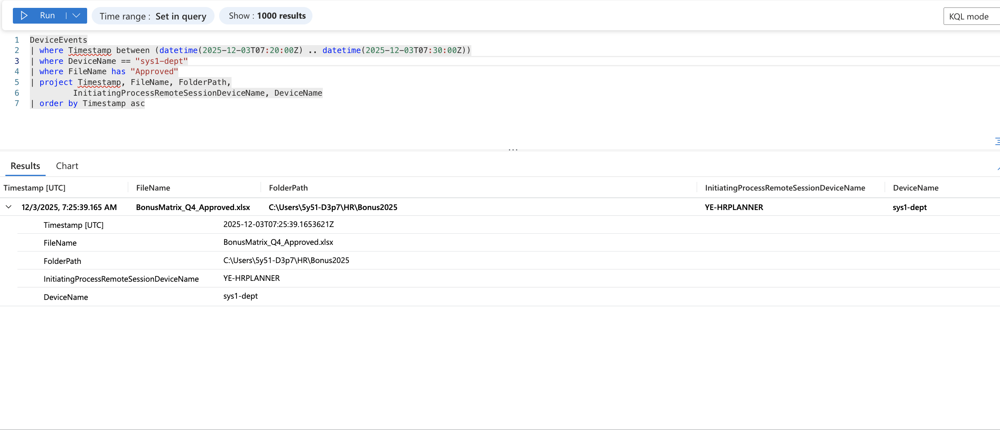

---

### 🚩 Flag 14: Candidate Archive Creation Location

**Objective:** Identify the file system location where a suspicious archive containing candidate-related material was created.

**Finding:** A compressed archive containing candidate evaluation data was created in a user-accessible Documents directory, consistent with data staging behavior.

**Key Details:**
- **Archive Path:** `C:\Users\5y51-D3p7\Documents\Q4Candidate_Pack.zip`
- **Location Type:** User profile directory (easily accessible, less monitored)

**Significance:** Staging archives in user Documents directories is common adversary behavior because:
- User profile directories have fewer access restrictions
- Less likely to trigger DLP policies than network shares
- Easier to exfiltrate from user-context applications

**KQL Query:**
```kql
DeviceFileEvents
| where Timestamp between (datetime(2025-12-03) .. datetime(2025-12-04))
| where DeviceName == "sys1-dept"
| where FileName endswith ".zip"
| project Timestamp, FileName, FolderPath, InitiatingProcessUniqueId
| order by Timestamp asc
```

**Screenshot:**

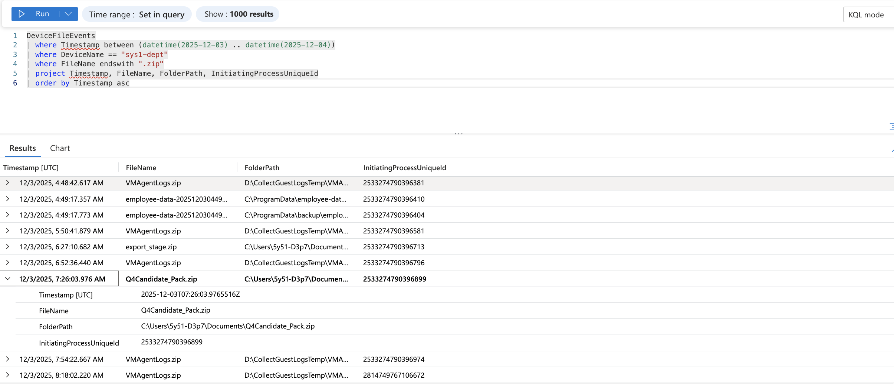

---

### 🚩 Flag 15: Outbound Transfer Attempt Timestamp

**Objective:** Confirm whether an outbound transfer attempt occurred after staging, validating exfiltration intent.

**Finding:** Network telemetry showed an outbound connection attempt **shortly after archive creation**, consistent with exfiltration testing or attempted data transfer.

**Key Details:**
- **Outbound Attempt Timestamp:** `2025-12-03T07:26:28.5959592Z`
- **Temporal Proximity:** <2 minutes after archive creation

**Significance:** The tight temporal correlation between archive creation and network connection attempt is a strong indicator of exfiltration behavior. This validates the complete attack lifecycle.

**KQL Query:**
```kql
DeviceNetworkEvents
| where TimeGenerated between (datetime(2025-12-03T07:25:00Z) .. datetime(2025-12-03T07:30:00Z))
| where DeviceName == "sys1-dept"
| project TimeGenerated, RemoteIP, RemoteUrl, InitiatingProcessCommandLine
| order by TimeGenerated asc
```

**Screenshot:**


---

### 🚩 Flag 16: Local Log Clearing Attempt Evidence

**Objective:** Identify evidence of attempted log clearing to reduce forensic visibility and evade detection.

**Finding:** Process creation events showed execution of Windows Event Utility (`wevtutil.exe`) to clear PowerShell operational logs.

**Key Details:**
- **Command Observed:** `"wevtutil.exe" cl Microsoft-Windows-PowerShell/Operational`
- **Target Logs:** PowerShell operational event logs

**Significance:** Log clearing attempts indicate:
- Operational security awareness
- Intent to evade detection
- Anti-forensic capabilities
- Sophisticated adversary tradecraft

This behavior aligns with MITRE ATT&CK technique T1070.001 (Indicator Removal: Clear Windows Event Logs).

**KQL Query:**
```kql
DeviceProcessEvents
| where Timestamp between (datetime(2025-12-03) .. datetime(2025-12-04))
| where FileName == "wevtutil.exe"
| project Timestamp, DeviceName, ProcessCommandLine
| order by Timestamp asc
```

**Screenshot:**

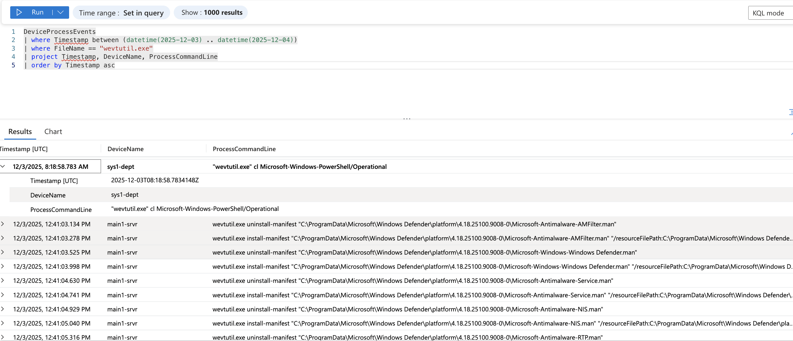

---

### 🚩 Flag 17: Second Endpoint Scope Confirmation

**Objective:** Identify additional endpoints involved in the activity chain to determine the full scope of compromise.

**Finding:** Similar telemetry patterns were observed on a second endpoint, indicating lateral movement:
- **Second Compromised Device:** `main1-srvr`
- **Remote Session Source:** Same IP (192.168.0.110)

**Significance:** Expansion to a second system demonstrates:
- Lateral movement capabilities
- Broader organizational impact
- Coordinated, multi-system operation
- Potential for enterprise-wide compromise

**KQL Query:**
```kql
DeviceProcessEvents
| where Timestamp between (datetime(2025-12-03) .. datetime(2026-01-04))
| where IsProcessRemoteSession == true
| where ProcessRemoteSessionIP == "192.168.0.110"
| summarize FirstSeen=min(Timestamp), LastSeen=max(Timestamp), EventCount=count() by DeviceName, ProcessRemoteSessionDeviceName, AccountName
| order by FirstSeen asc
```

**Screenshot:**

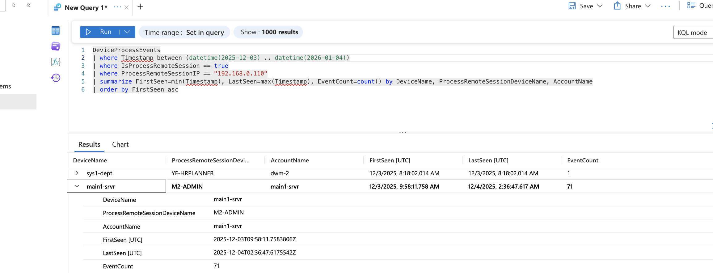

---

### 🚩 Flag 18: Approved Bonus Artifact Access on Second Endpoint

**Objective:** Confirm access to approved bonus artifacts on the second endpoint, demonstrating persistent targeting.

**Finding:** Approved bonus data was accessed again on the second system (`main1-srvr`), indicating continued pursuit of high-value compensation data.

**Key Details:**
- **Initiating Process Creation Time:** `2025-12-04T03:11:58.6027696Z`
- **Target System:** Server infrastructure (vs. workstation)

**Significance:** Repeated access to approved bonus artifacts on a second endpoint suggests:
- Systematic data collection across multiple repositories
- Server infrastructure targeting (potentially more complete datasets)
- Redundant data collection for reliability

**KQL Query:**
```kql
DeviceProcessEvents
| where Timestamp between (datetime(2025-12-04T03:00:00Z) .. datetime(2025-12-04T03:30:00Z))
| where DeviceName == "main1-srvr"
| project TimeGenerated, DeviceName, ProcessCommandLine, ProcessCreationTime, InitiatingProcessRemoteSessionDeviceName, InitiatingProcessRemoteSessionIP
```

**Screenshot:**

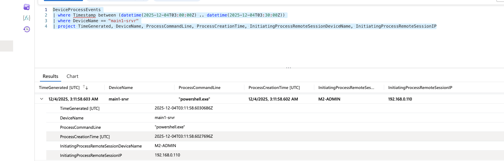

---

### 🚩 Flag 19: Employee Scorecard Access on Second Endpoint

**Objective:** Confirm repeated employee scorecard access and identify the associated remote session context.

**Finding:** Scorecard files were accessed on the second endpoint via **yet another distinct remote session device**:
- **Remote Session Device:** `YE-FINANCEREVIE`
- **Device Type:** Finance Review workstation

**Significance:** This marks the **fourth distinct remote session context** observed in the investigation:
1. M1-ADMIN
2. YE-HELPDESKTECH
3. YE-HRPLANNER
4. YE-FINANCEREVIE

The breadth of remote session sources suggests either:
- Widespread credential compromise
- Multiple coordinating insiders
- Lateral movement using legitimate administrative tools

**KQL Query:**
```kql
DeviceProcessEvents
| where Timestamp between (datetime(2025-12-04) .. datetime(2025-12-06))
| where DeviceName == "main1-srvr"
| where ProcessCommandLine has_any ("scorecard", "Scorecard", "review", "Review", "performance", "Performance")
| where IsProcessRemoteSession == true or IsInitiatingProcessRemoteSession == true
| project Timestamp, DeviceName, AccountName, FileName, ProcessCommandLine,
          ProcessRemoteSessionDeviceName, ProcessRemoteSessionIP,
          InitiatingProcessRemoteSessionDeviceName, InitiatingProcessRemoteSessionIP
| order by Timestamp asc
```

**Screenshot:**

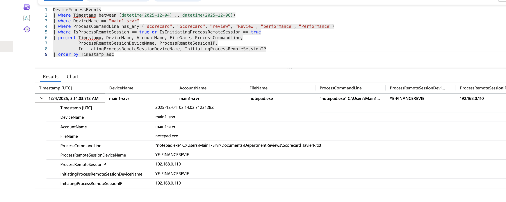

---

### 🚩 Flag 20: Staging Directory Identification on Second Endpoint

**Objective:** Identify the directory used for final data consolidation on the secondary compromised system.

**Finding:** Archived review materials were staged in an internal references directory with organized subdirectory structure:
- **Staging Path:** `C:\Users\Main1-Srvr\Documents\InternalReferences\ArchiveBundles\YearEnd_ReviewPackage_2025.zip`

**Significance:** The use of a nested, organized directory structure suggests:
- Deliberate organization for large-scale data collection
- Long-term operational planning
- Multiple collection cycles (ArchiveBundles implies plural operations)
- Professional data management practices

**KQL Query:**
```kql
DeviceFileEvents
| where Timestamp between (datetime(2025-12-04) .. datetime(2025-12-05))
| where DeviceName == "main1-srvr"
| where FolderPath has "InternalReferences"
| project Timestamp, FileName, FolderPath
| order by Timestamp asc
```

**Screenshot:**

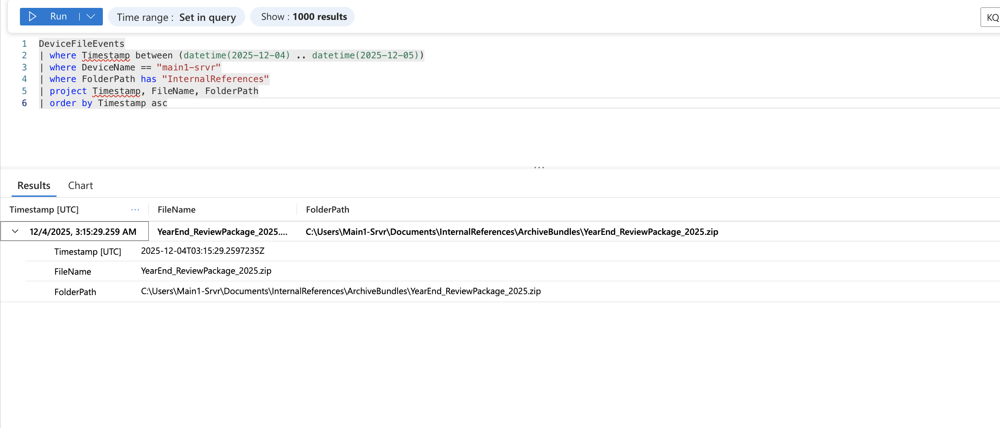

---

### 🚩 Flag 21: Staging Activity Timing on Second Endpoint

**Objective:** Determine the precise timing of final staging activity to establish the complete attack timeline.

**Finding:** Final staging activity on the second endpoint occurred at:
- **Timestamp:** `2025-12-04T03:15:29.2597235Z`
- **Time Window:** Early morning hours (off-hours activity)

**Significance:** The timing reveals:
- Off-hours operation (03:15 AM) to avoid detection
- Approximately 24 hours after initial endpoint staging
- Coordinated, sequential operation across endpoints
- Deliberate operational security timing

**KQL Query:**
```kql
DeviceFileEvents
| where Timestamp between (datetime(2025-12-04T03:10:00Z) .. datetime(2025-12-04T03:20:00Z))
| where DeviceName == "main1-srvr"
| where FolderPath has "ArchiveBundles"
| project Timestamp, FileName, FolderPath
| order by Timestamp asc
```

**Screenshot:**

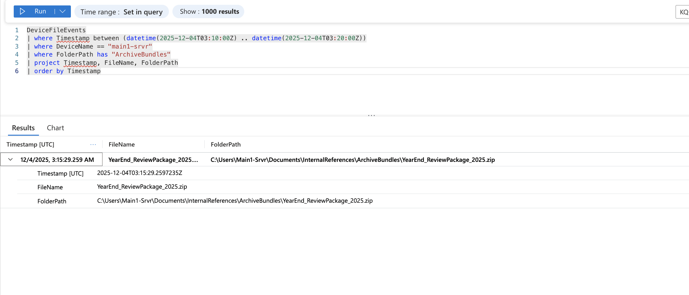

---

### 🚩 Flag 22: Outbound Connection Remote IP (Final Phase)

**Objective:** Identify the external destination IP associated with the final outbound connection attempt.

**Finding:** Network telemetry confirmed a final outbound connection attempt to:
- **Remote IP:** `54.83.21.156`
- **Direction:** Outbound from main1-srvr

**Significance:** This represents the final phase of the exfiltration attempt. The distinct IP address (compared to earlier connection attempts) suggests:
- Multiple exfiltration channels tested
- Redundant data transfer infrastructure
- Potential command and control (C2) infrastructure

Further investigation should include:
- IP geolocation and reputation analysis
- SSL/TLS certificate inspection
- Historical connection patterns to this IP
- Potential indicators of compromise (IOCs) sharing with threat intelligence platforms

**KQL Query:**
```kql
DeviceNetworkEvents
| where TimeGenerated between (datetime(2025-12-04) .. datetime(2025-12-05))
| where DeviceName == "main1-srvr"
| project TimeGenerated, RemoteIP, RemoteUrl, InitiatingProcessCommandLine
| order by TimeGenerated asc
```

**Screenshot:**

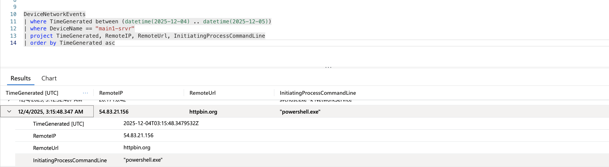

---

## ⏱️ Reconstructed Attack Timeline

| **Timestamp (UTC)** | **Endpoint** | **Activity** | **MITRE Technique** |
|---------------------|--------------|--------------|---------------------|
| 2025-12-01 | sys1-dept | Initial remote session from M1-ADMIN (192.168.0.110) | T1078 - Valid Accounts |
| 2025-12-03 06:28 | sys1-dept | Scheduled task created for PowerShell execution | T1053.005 - Scheduled Task |
| 2025-12-03 07:25 | sys1-dept | Sensitive bonus and performance review artifacts accessed | T1005 - Data from Local System |
| 2025-12-03 07:25 | sys1-dept | Registry Run key modified for persistence | T1547.001 - Registry Run Keys |
| 2025-12-03 07:26 | sys1-dept | Archive (Q4Candidate_Pack.zip) staged in Documents directory | T1560 - Archive Collected Data |
| 2025-12-03 07:26 | sys1-dept | Outbound network connection attempt observed | T1567 - Exfiltration Over Web Service |
| 2025-12-03 07:27 | sys1-dept | Log clearing attempt via wevtutil.exe | T1070.001 - Clear Windows Event Logs |
| 2025-12-03 | sys1-dept | Access from YE-HELPDESKTECH (scorecard files) | T1078 - Valid Accounts |
| 2025-12-03 | sys1-dept | Access from YE-HRPLANNER (bonus matrix files) | T1078 - Valid Accounts |
| 2025-12-04 03:11 | main1-srvr | Activity expands to second endpoint from same source IP | T1021 - Remote Services |
| 2025-12-04 03:15 | main1-srvr | Consolidated archive (YearEnd_ReviewPackage_2025.zip) staged | T1560 - Archive Collected Data |
| 2025-12-04 | main1-srvr | Access from YE-FINANCEREVIE (scorecard files) | T1078 - Valid Accounts |
| 2025-12-04 | main1-srvr | Final outbound connection attempt to 54.83.21.156 | T1567 - Exfiltration Over Web Service |

> **Analysis:** This timeline demonstrates deliberate progression from access → reconnaissance → collection → staging → persistence → exfiltration attempt. The 24-hour gap between first and second endpoint activity suggests careful, methodical operation with operational security awareness.

---

## 📝 Summary of Key Findings

This comprehensive investigation revealed:

### Adversary Behavior Patterns
- **Lateral Movement:** Multiple remote session contexts from different organizational units (IT Admin, Helpdesk, HR Planning, Finance Review)
- **Data Escalation:** Systematic progression from draft documents to approved/final compensation materials
- **Multi-Endpoint Activity:** Coordinated expansion from workstation (sys1-dept) to server infrastructure (main1-srvr)
- **Anti-Forensics:** Active log clearing using wevtutil.exe to reduce forensic visibility
- **Persistence:** Dual persistence mechanisms (Registry Run key + Scheduled Task) for operational resilience
- **Exfiltration Attempts:** Multiple outbound connection attempts to different external IPs following data staging

### Scope of Compromise
- **Affected Endpoints:** 2 confirmed systems (sys1-dept, main1-srvr)
- **Remote Session Sources:** 4 distinct devices across different business units
- **Data Categories Accessed:**
  - Year-end bonus matrices (draft and approved versions)
  - Employee performance reviews
  - Employee scorecards
  - Candidate evaluation packages
  - Compensation planning documents

### Technical Indicators
- **Account:** 5y51-d3p7
- **Source IP:** 192.168.0.110
- **Staging Locations:**
  - C:\Users\5y51-D3p7\Documents\Q4Candidate_Pack.zip
  - C:\Users\Main1-Srvr\Documents\InternalReferences\ArchiveBundles\YearEnd_ReviewPackage_2025.zip
- **Exfiltration IPs:** Multiple external destinations detected
- **Persistence Registry Key:** HKCU\Software\Microsoft\Windows\CurrentVersion\Run
- **Log Clearing:** Microsoft-Windows-PowerShell/Operational event logs

### Operational Characteristics
The activity demonstrates a **coordinated, multi-stage operation** with clear intent to access, consolidate, and exfiltrate sensitive year-end compensation and performance review data. The adversary exhibits:
- **Environmental awareness** (knowledge of file locations, organizational structure)
- **Operational security** (off-hours activity, log clearing)
- **Persistence planning** (dual mechanisms for long-term access)
- **Systematic approach** (methodical progression through data types and endpoints)

---

## 🚨 Business Impact Assessment

If successful, this intrusion could have resulted in significant business and regulatory consequences:

### Direct Impacts
- **Confidentiality Breach:** Unauthorized disclosure of employee compensation data, performance reviews, and evaluation criteria
- **Competitive Intelligence:** Exposure of organizational compensation strategies and talent management approaches
- **Employee Privacy Violations:** Breach of confidential personnel information affecting multiple employees
- **Insider Trading Risk:** Compensation insight could enable securities law violations if disclosed to external parties

### Regulatory & Compliance Implications
- **GDPR/Privacy Regulations:** Potential personal data breach requiring regulatory notification
- **SOX Compliance:** Financial data handling violations
- **Labor Law Violations:** Unauthorized compensation data disclosure
- **SEC Reporting Obligations:** Material insider information exposure

### Reputational & Operational Risks
- **Employee Trust Erosion:** Loss of confidence in organization's ability to protect sensitive HR data
- **Talent Acquisition Impact:** Negative publicity affecting recruitment and retention
- **Litigation Exposure:** Potential employee lawsuits for privacy violations
- **Insurance Implications:** Cyber insurance claims, potential premium increases

### Financial Impact Estimates
- Incident response and forensic investigation costs
- Legal and regulatory compliance expenses
- Potential regulatory fines
- Remediation and security enhancement investments
- Employee notification and credit monitoring costs
- Reputational damage and brand restoration

**Risk Severity:** HIGH

The progression from draft documents to finalized, board-approved compensation artifacts indicates **escalating risk exposure** and targeted intent. The multi-endpoint expansion and involvement of multiple departmental remote sessions further suggest **coordinated activity** with potential for enterprise-wide impact.

---

## 🛡️ Detection & Hardening Recommendations

Based on observed attack patterns, the following detection and prevention controls are recommended:

### Detection Engineering Improvements

#### High-Priority Detection Rules

1. **PowerShell Execution from User Directories**
   ```kql
   DeviceProcessEvents
   | where FileName in~ ("powershell.exe", "pwsh.exe")
   | where FolderPath has_any ("\\Downloads\\", "\\Documents\\", "\\AppData\\Local\\Temp\\")
   | where ProcessCommandLine has ".ps1"
   ```
   **Rationale:** Detects script execution from non-standard, user-writable locations

2. **HKCU Run Key Modifications**
   ```kql
   DeviceRegistryEvents
   | where ActionType == "RegistryValueSet"
   | where RegistryKey has "\\Software\\Microsoft\\Windows\\CurrentVersion\\Run"
   | where RegistryKey !has "HKLM" // Focus on HKCU modifications
   ```
   **Rationale:** Identifies user-level persistence attempts

3. **Scheduled Task Creation Patterns**
   ```kql
   DeviceProcessEvents
   | where FileName == "schtasks.exe"
   | where ProcessCommandLine has_any ("/Create", "/SC", "/TN")
   ```
   **Rationale:** Monitors scheduled task-based persistence establishment

4. **Suspicious Archive Creation**
   ```kql
   DeviceFileEvents
   | where FileName endswith ".zip"
   | where FolderPath has_any ("\\Documents\\", "\\Desktop\\", "\\Downloads\\")
   | summarize FileCount = count() by InitiatingProcessAccountName, bin(Timestamp, 5m)
   | where FileCount > 3 // Multiple archives in short timeframe
   ```
   **Rationale:** Detects data staging through archive creation

5. **Remote Session Context Changes**
   ```kql
   DeviceProcessEvents
   | where IsProcessRemoteSession == true
   | where DeviceName in ("sys1-dept", "main1-srvr") // High-value targets
   | summarize UniqueRemoteDevices = dcount(ProcessRemoteSessionDeviceName) by DeviceName, bin(Timestamp, 1h)
   | where UniqueRemoteDevices > 2
   ```
   **Rationale:** Identifies suspicious remote session patterns

6. **PowerShell Operational Log Clearing**
   ```kql
   DeviceProcessEvents
   | where FileName == "wevtutil.exe"
   | where ProcessCommandLine has_all ("cl", "PowerShell")
   ```
   **Rationale:** Detects anti-forensic log clearing attempts

7. **Post-Archive Network Connections**
   ```kql
   let ArchiveCreation = DeviceFileEvents
   | where FileName endswith ".zip"
   | project DeviceName, ArchiveTime=Timestamp, InitiatingProcessId;
   DeviceNetworkEvents
   | join kind=inner (ArchiveCreation) on DeviceName
   | where TimeGenerated between (ArchiveTime .. (ArchiveTime + 10m))
   | where RemoteIPType == "Public"
   ```
   **Rationale:** Correlates data staging with exfiltration attempts

8. **HR/Finance Directory Access from Remote Sessions**
   ```kql
   DeviceFileEvents
   | where InitiatingProcessRemoteSessionDeviceName != ""
   | where FolderPath has_any ("HR", "Finance", "Compensation", "Payroll", "Bonus")
   | where ActionType in ("FileCreated", "FileModified", "FileRenamed")
   ```
   **Rationale:** Monitors sensitive directory access from remote contexts

### Hardening Measures

#### Access Control Enhancements
- ✅ **Implement Conditional Access Policies:**
  - Require MFA for all remote administrative sessions
  - Restrict remote access to approved devices only
  - Enforce location-based access controls for sensitive data

- ✅ **Least Privilege Enforcement:**
  - Review and restrict HR file share permissions
  - Implement role-based access control (RBAC) for compensation data
  - Remove unnecessary administrative privileges
  - Require approval workflows for elevated access

#### Logging & Monitoring
- ✅ **Enhanced PowerShell Logging:**
  - Enable PowerShell Script Block Logging
  - Enable PowerShell Module Logging
  - Enable PowerShell Transcription
  - Increase log retention period to minimum 90 days

- ✅ **Log Protection:**
  - Enable Windows Event Log Tampering Protection
  - Forward logs to centralized SIEM in real-time
  - Implement log integrity monitoring
  - Alert on event log service disruptions

#### Endpoint Protection
- ✅ **Microsoft Defender Enhancements:**
  - Enable Tamper Protection
  - Configure Attack Surface Reduction (ASR) rules:
    - Block PowerShell execution from user-writable directories
    - Block process creation from PSExec and WMI
    - Block credential stealing from LSASS
  - Enable Controlled Folder Access for HR directories

- ✅ **Application Control:**
  - Implement AppLocker or Windows Defender Application Control (WDAC)
  - Restrict script execution to signed scripts only
  - Whitelist approved administrative tools

#### Network Security
- ✅ **Egress Filtering:**
  - Implement outbound firewall rules for HR/Finance endpoints
  - Block direct internet access from sensitive data servers
  - Require proxy-based web access with SSL inspection
  - Monitor and alert on anomalous outbound connections

- ✅ **Data Loss Prevention (DLP):**
  - Deploy endpoint DLP policies for sensitive file types
  - Block or alert on file transfers to external domains
  - Monitor cloud storage upload attempts
  - Implement email DLP for compensation-related keywords

#### User Behavior Analytics
- ✅ **UEBA Implementation:**
  - Establish baseline behavior for HR system access
  - Alert on off-hours access to sensitive directories
  - Monitor for unusual remote session patterns
  - Detect anomalous file access volume

### Response Procedures

#### Immediate Actions (0-2 Hours)
1. Isolate affected endpoints from network
2. Preserve forensic evidence (memory dumps, disk images)
3. Disable compromised account credentials
4. Block identified IOCs (IPs, file hashes)
5. Notify incident response team and legal counsel

#### Short-Term Actions (2-24 Hours)
1. Conduct full environment scan for similar indicators
2. Review all remote sessions from source IP
3. Audit access logs for affected file shares
4. Interview account owners and departmental users
5. Engage external forensics if necessary

#### Long-Term Actions (1-7 Days)
1. Implement detection rules and hardening measures
2. Conduct tabletop exercise for similar scenarios
3. Review and update incident response procedures
4. Provide security awareness training to affected departments
5. Consider third-party security assessment

---

## 👨‍💻 Analyst Reflection

This investigation exemplifies several key principles of modern threat hunting and incident response:

### Methodological Strengths

**Hypothesis-Driven Approach:** Rather than reacting solely to alerts, this hunt began with a hypothesis about abnormal year-end activity patterns. This proactive methodology enabled early detection before significant data loss occurred.

**Multi-Source Telemetry Correlation:** The investigation successfully correlated four distinct telemetry sources (process, file, registry, network events) to reconstruct a complete attack narrative. This demonstrates the value of comprehensive endpoint visibility.

**Temporal Analysis:** Careful attention to timestamps revealed the operational tempo of the adversary, including:
- Off-hours activity patterns
- Tight correlation between staging and exfiltration attempts
- Sequential progression across endpoints

**Remote Session Metadata Analysis:** Leveraging remote session context fields (`ProcessRemoteSessionDeviceName`, `InitiatingProcessRemoteSessionDeviceName`) proved critical in identifying:
- Multiple compromised or complicit accounts
- Cross-departmental scope
- Lateral movement patterns

### Technical Insights

**PowerShell as Initial Access:** The use of PowerShell for initial execution highlights its continued role in modern attacks. While PowerShell is a legitimate administrative tool, its presence in non-standard locations (user Downloads/Documents) remains a strong indicator.

**Dual Persistence Mechanisms:** The adversary's use of both registry Run keys and scheduled tasks demonstrates operational maturity and awareness of detection risks. This redundancy suggests experience with previous defensive countermeasures.

**Anti-Forensic Awareness:** The attempted log clearing shows the adversary understands modern detection capabilities and actively works to evade them. This reinforces the importance of:
- Real-time log forwarding to SIEM
- Log tampering protection
- Immutable audit trails

**Data Staging Behavior:** The creation of organized archive structures (`ArchiveBundles` directory) suggests this may not be the first occurrence. Historical review of these directories may reveal prior incidents.

### Operational Learnings

**Credential Hygiene:** The involvement of multiple remote session contexts (M1-ADMIN, YE-HELPDESKTECH, YE-HRPLANNER, YE-FINANCEREVIE) suggests either:
1. Widespread credential compromise
2. Weak password policies enabling lateral movement
3. Coordinated insider threat activity

This highlights the critical need for:
- Regular password rotation policies
- Privileged Access Management (PAM) solutions
- Administrative credential segmentation

**Off-Hours Monitoring:** The concentration of malicious activity during off-hours (03:00-07:00 UTC) demonstrates the importance of 24/7 SOC operations and automated alerting. Many organizations reduce monitoring during these windows, creating detection gaps.

**Cross-Device Hunting:** The expansion to a second endpoint (`main1-srvr`) was only detected through proactive threat hunting using common IOCs (source IP 192.168.0.110). This underscores the value of:
- IOC pivoting across the enterprise
- Assumption of lateral movement in initial response
- Enterprise-wide hunting queries

### Detection Engineering Observations

The queries developed during this investigation can serve as foundations for persistent detection rules:

**Strengths of KQL for Threat Hunting:**
- Powerful time-based filtering and correlation
- Native support for remote session metadata
- Efficient string matching and pattern detection
- Statistical aggregation for anomaly detection

**Areas for Enhancement:**
- Need for machine learning-based anomaly detection for evolving tactics
- Enhanced user behavior profiling (UEBA)
- Automated threat hunting playbook execution
- Threat intelligence integration for known IOCs

### Broader Strategic Implications

This investigation reinforces several strategic security priorities:

**Defense in Depth:** No single control would have prevented this intrusion. Successful defense requires layered controls:
- Preventive (access restrictions, MFA)
- Detective (logging, alerting, hunting)
- Responsive (isolation, remediation)

**Visibility is Foundational:** Without comprehensive endpoint telemetry (MDE), this sophisticated attack chain would likely have gone undetected until data appeared externally. Investment in visibility pays continuous dividends.

**Threat Hunting ROI:** This proactive hunt detected an intrusion that had not triggered automated alerts, demonstrating the value of skilled analysts augmenting automated detection.

**Insider Threat Considerations:** The behavioral patterns observed align with both external adversaries using compromised credentials and potential insider threats. This ambiguity highlights the need for:
- User behavior analytics
- Data classification and access auditing
- Regular insider threat awareness training

### Personal Development Takeaways

As a security analyst, this investigation reinforced several professional competencies:

✅ **Advanced Hunting (KQL):** Demonstrated proficiency in complex query construction, multi-table joins, and temporal correlation

✅ **Threat Hunting Methodology:** Applied structured hypothesis-driven approach from initial detection through full scope determination

✅ **Lateral Movement Detection:** Successfully identified cross-device activity through common IOC analysis

✅ **Data Exfiltration Analysis:** Recognized and validated complete exfiltration chain (access → collect → stage → transfer)

✅ **Registry & Scheduled Task Persistence Analysis:** Identified and documented dual persistence mechanisms

✅ **Windows Event Log Analysis:** Detected anti-forensic log clearing attempts

✅ **MITRE ATT&CK Mapping:** Accurately mapped observed behaviors to appropriate tactics and techniques

✅ **Incident Timeline Reconstruction:** Created comprehensive attack timeline with granular timestamps

✅ **Detection Engineering:** Developed actionable detection rules based on observed behaviors

✅ **Executive Communication:** Translated technical findings into business risk language

### Conclusion

This hunt highlights how seemingly legitimate administrative access can evolve into coordinated multi-stage data exfiltration attempts. The structured correlation of telemetry across two endpoints, multiple remote session contexts, and several days of activity reinforced the importance of:

- **Proactive threat hunting** beyond automated alerting
- **Cross-device correlation** when investigating credential-based intrusions
- **Temporal analysis** to understand adversary operational tempo
- **Remote session metadata** as a critical investigation dimension

Most importantly, this case demonstrates that **comprehensive endpoint visibility + skilled analysis = early detection** of sophisticated threats that automated systems might miss.

The patterns, queries, and detection strategies developed during this investigation will inform future threat hunting operations and strengthen the organization's overall security posture.

---

## 🔎 Skills Demonstrated

This investigation showcases the following technical competencies and tools:

### Security Tools & Platforms
- ✅ Microsoft Defender for Endpoint (MDE)
- ✅ Azure Sentinel SIEM
- ✅ Advanced Hunting with KQL
- ✅ Endpoint Detection and Response (EDR)
- ✅ Log Analysis and Correlation

### Technical Skills
- ✅ Kusto Query Language (KQL) - Advanced proficiency
- ✅ Threat Hunting Methodology (Hypothesis-driven)
- ✅ Lateral Movement Detection
- ✅ Data Exfiltration Pattern Analysis
- ✅ Windows Registry Forensics
- ✅ Scheduled Task Analysis
- ✅ PowerShell Operational Security Analysis
- ✅ Windows Event Log Analysis
- ✅ Network Traffic Analysis
- ✅ File System Forensics
- ✅ Remote Session Analysis

### Frameworks & Methodologies
- ✅ MITRE ATT&CK Framework Mapping
- ✅ Cyber Kill Chain Analysis
- ✅ Incident Timeline Reconstruction
- ✅ Root Cause Analysis
- ✅ Attack Surface Analysis

### Analytical Capabilities
- ✅ Multi-Source Telemetry Correlation
- ✅ Temporal Pattern Analysis
- ✅ Behavioral Analytics
- ✅ Anomaly Detection
- ✅ Indicator of Compromise (IOC) Development
- ✅ Threat Actor Profiling

### Detection Engineering
- ✅ Custom Detection Rule Development
- ✅ Alert Tuning and Optimization
- ✅ False Positive Reduction
- ✅ Detection Coverage Mapping

### Communication & Reporting
- ✅ Technical Report Writing
- ✅ Executive Summary Development
- ✅ Business Impact Assessment
- ✅ Risk Communication
- ✅ Stakeholder Briefing

### Security Operations
- ✅ Incident Response Procedures
- ✅ Forensic Evidence Preservation
- ✅ Remediation Planning
- ✅ Security Control Recommendations

---

## 📚 Additional Resources

For those interested in learning more about the techniques and tools used in this investigation:

### MITRE ATT&CK Resources
- [ATT&CK Navigator](https://mitre-attack.github.io/attack-navigator/)
- [ATT&CK for Enterprise](https://attack.mitre.org/matrices/enterprise/)

### Microsoft Defender Documentation
- [Advanced Hunting Query Reference](https://learn.microsoft.com/en-us/microsoft-365/security/defender/advanced-hunting-overview)
- [KQL Quick Reference](https://learn.microsoft.com/en-us/azure/data-explorer/kql-quick-reference)

### Threat Hunting Resources
- [SANS Threat Hunting Resources](https://www.sans.org/cyber-security-courses/advanced-threat-hunting/)
- [ThreatHunter-Playbook](https://threathunterplaybook.com/)

---

## 📞 Contact & Attribution

**Author:** Security Operations Team  
**Investigation Lead:** Carlos Funezsanchez  
**Review Date:** February 16, 2026  
**Version:** 1.0

> **Note:** This threat hunt report represents a simulated security investigation exercise. All indicators, endpoints, and scenarios are fictitious and created for educational and portfolio demonstration purposes.

---

**Report Classification:** Internal Use Only  
**Distribution:** Security Operations, Incident Response Team, Executive Leadership  
**Document Control:** Version 1.0 - February 16, 2026

---

<div align="center">

### 🛡️ Defense Through Detection


---

**[⬆ Back to Top](#-threat-hunt-report-crosscheck--multi-stage-hr-data-exfiltration-simulation)**

</div>
